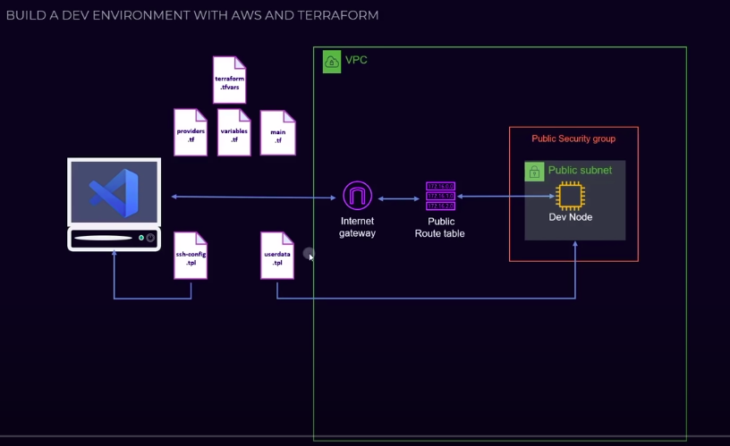

### This project is exactly or slightly modified version of the tutorial on terraform by [freecodecamp.org, youtube, "Learn Terraform and AWS by Building a Dev Environment – Full Course for Beginners"](https://www.youtube.com/watch?v=iRaai1IBlB0)
# Big Thanks to Derek Morgan !!!
## Objective
    Create a VPC in your own VPC/Subnet and connect from local using KeyPair
## Design

## Steps
    1. To create a VPC, a subet and IGW inside the VPC.
    2. Create a route table with the route open to IGW.
    3. Associate the subnet with the route table, so that it's a public subnet.
    4. Create a SG, add i/b and o/b rules inside the VPC.
    5. Create a KeyPair, use this KeyPair to create an EC2.
    6. Create a config file in your local machine dynamically with the EC2 detials (use - [provisioner and interpreter]). so that you can ssh into the EC2 using the KeyPair from your local/local VS.
    7. Use variables, conditional expressions for dynamic assignments

# NOTES 
## Providers
    1. To interact with the many resources supported by AWS. 
    You must configure the provider with the proper credentials before you can use it.
    2. Authentication can be done in several ways, which are applied in the following order
       1. Parameters in the provider configuration
       2. Environment variables
       3. Shared credentials files
       4. Shared configuration files
       5. Container credentials
       6. Instance profile credentials and region
## Terraform Commands
```diff
+**terraform init**
    
    1. This will initialize the terrform by installing necessary providers.
    2. Under .terraform/.terraform.lock.hcl records the provider selections it made above. 
    Include this file in your version control repository so that Terraform can guarantee to make the same selections by default when you run "terraform init" in the future.

+**terraform plan**

+**terraform apply** 

+**terraform apply -auto-approve**

+**terraform apply -replace**

+**terraform apply refresh**

-**terraform destroy** 

+**terraform fmt**

+**terraform output**

+**terraform console**

+**terraform console -var="ssh-config=hai"**

+**terraform console -var-file="dev.tfvars"**

+**terraform state list**

+**terraform state show [aws-resource-syntax].[terraform-resource-name]**

```

### State 
    1. Terraform.tfstate is created after giving terraform plan/apply, this is generally stored in terraform cloud or aws cloud etc..
    DO NOT ALTER this file
    2. To access this state file 
        2.1. **terraform state list** --> list of all resources you created using this folder terrafrom
        2.2. **terraform state show <aws-resource-syntax>.<terraform-resource-name>** --> 
        gives the details of that resource.
    3. State file helps in 
        3.1 Mapping to the actual AWS resources
        3.2 Metadata - like dependencies
        3.3 Performance - stores a cache of the attribute values for all resources in the state.
        3.4 Syncing - when working in a team, remote state is recommended. 
        Terraform can use remote locking as a measure to avoid two or more different users accidentally running Terraform at the same time, and thus ensure that each Terraform run begins with the most recent updated state.
    4. For every plan and apply, terraform will sync up the state and the actual resources.

### VPC 
    Virtual Private Cloud, enables you to launch AWS resources into a virtual network that you've defined.

### Subnets
    Divide VPC into small groups, can give different rules on each subnet thus improving security. 
    It is a range of IP addresses in your VPC. You can launch AWS resources, such as EC2 instances, into a specific subnet. 
    When you create a subnet, you specify the IPv4 CIDR block for the subnet, which is a subset of the VPC CIDR block.

### CIDR - Classless Inter-Domain Routing [quick reference video](https://www.youtube.com/watch?v=aPW-ZAo09Pg)
    1. Can define the IP address pattern and how many we will allow to have.
    2. Example 172.31.12.0/24 CIDR block notation.
    This notation contains <network portion - 172.31.12><host portion - 0>. 
    This portion split is happened because we defined 24 bits are network by giving /24.
        octate1 ( 8 bit ) - 172
        octate2 ( 8 bit ) - 31
        octate3 ( 8 bit ) - 12
        octate4 ( 8 bit ) - 0
        toal ( 32 bit ) - 172.31.0.0
        Here host portion is 8 bits i,e 2^8 = 256 ( ip address can be generated in the n/w 172.31.0.[0-255])
    3. Example2, a vpc with 2 subnets and each should have 100 ips capcaity: 
        VPC CIDR = 172.31.12.0/24
        Subnet1 CIDR = 172.31.12.0/25 --> 
        here network got 25 bits and only last octate's 7 bits are assigned for host. so 2^7 = 128 ips only can be generated here [0-127]
        Subnet2 CIDR = 172.31.12.128/25 --> 
        here network got 25 bits and only last octate's 7 bits are assigned for host. so 2^7 = 128 ips only can be generated here [128-155]

### IGW
    Internet Gateway, allows resources within your VPC to access the internet, and vice versa. 
    In order for this to happen, there needs to be a routing table entry allowing a subnet to access the IGW.

### Security Group
    SG acts as a virtual firewall for your EC2 instances to control incoming and outgoing traffic. 
    These are stateless, meaning any change applied to an incoming rule isn't automatically applied to an outgoing rule.

    Egress in the world of networking implies traffic that exits an entity or a network boundary, while Ingress is traffic that enters the boundary of a network.

### Keypair
    A key pair, consisting of a public key and a private key. 
    It is a set of security credentials that you use to prove your identity when connecting to an Amazon EC2 instance. 
    Amazon EC2 stores the public key on your instance, and you store the private key.

